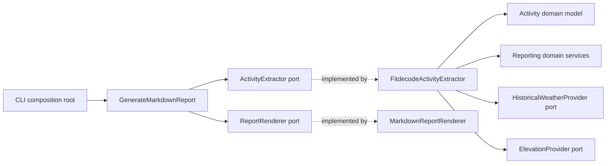

# Architecture

`fitToMd` follows Domain-Driven Design with inward-pointing dependencies. FIT decoding, HTTP providers, Markdown formatting, and CLI concerns are adapters around a decoder-independent domain.

## Bounded Contexts

### Activity

`fit_to_md.domain.activity` contains the normalized activity model:

- `Activity`: session metadata, sport, laps, and records.
- `ActivitySession`: normalized session totals, averages, timestamps, and start coordinates.
- `ActivityLap`: normalized lap measurements.
- `ActivityRecord`: timestamped sensor and route measurements.

These entities contain no fitdecode objects, raw FIT dictionaries, or FIT field names. Another decoder can produce the same model without changing reporting rules.

### Reporting

`fit_to_md.domain.reporting` contains:

- immutable report entities (`FitReport`, `SessionSummary`, `Split`, and dynamics samples);
- ports for activity extraction, rendering, elevation, and historical weather;
- domain services that compute summaries, kilometer splits, smoothed elevation, and dynamics from an `Activity`.

## Layers and Flow

The CLI is the composition root: it selects concrete adapters and injects them into the application use case. The default composition remains local and does not create weather or elevation providers.

## Dependency Rules

- Domain modules may depend only on the standard library and other domain modules.
- Application modules depend on domain entities and ports, never concrete infrastructure.
- Infrastructure modules implement ports and translate external formats into domain entities.
- CLI code owns concrete wiring and configuration.
- External HTTP behavior must be covered with fakes; tests must not require live network access.

`tests/unit/domain/test_architecture.py` enforces the most important rule by rejecting imports from the domain into application or infrastructure packages.

The former `infrastructure.fitdecode.builders` and `infrastructure.fitdecode.models` modules are compatibility-only re-exports. New code must import reporting services and activity entities from the domain packages directly.

## Extending the Project

- Add another activity format by translating it to `Activity`, `ActivityLap`, and `ActivityRecord`.
- Add a report calculation in the reporting domain services and cover happy and failure paths with domain unit tests.
- Add a new output block through a `ReportSectionRenderer` implementation.
- Add an external provider by implementing the relevant port and injecting it from the CLI composition root.
