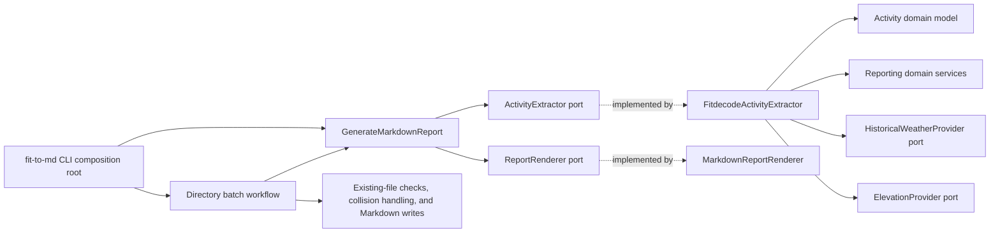
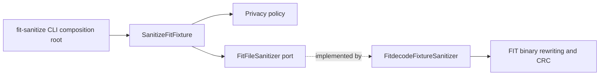

# Architecture

`fitToMd` follows Domain-Driven Design with inward-pointing dependencies. FIT decoding, HTTP providers, Markdown formatting, and CLI concerns are adapters around a decoder-independent domain.

## Bounded Contexts

### Activity

`fit_to_md.domain.activity` contains the normalized activity model:

- `Activity`: session metadata, sport, laps, and records.
- `ActivitySession`: normalized session totals, averages, timestamps, and start coordinates.
- `ActivityLap`: normalized lap measurements.
- `ActivityRecord`: timestamped sensor and route measurements.

These entities contain no fitdecode objects, raw FIT dictionaries, or FIT field names. Another decoder can produce the same model without changing reporting rules.

### Reporting

`fit_to_md.domain.reporting` contains:

- immutable report entities (`FitReport`, `SessionSummary`, `Split`, and dynamics samples);
- ports for activity extraction, rendering, elevation, and historical weather;
- a typed elevation diagnostics contract for progress callbacks and structured
  per-run request statistics;
- domain services that compute summaries, kilometer splits, smoothed elevation, and dynamics from an `Activity`.

Reporting is the only domain context that may depend on Activity. Activity does
not depend on Reporting.

### Privacy

`fit_to_md.domain.privacy` contains the FIT-fixture sanitization policy, the
`FitFileSanitizer` port, and the immutable `SanitizationSummary` returned by that
port. The policy decides which FIT messages and fields are retained; it is
intentionally FIT-specific because its purpose is to produce safe, structurally
valid FIT fixtures rather than a format-neutral activity model.

Privacy is isolated from Activity and Reporting. Binary FIT parsing, timestamp
rewriting, definition rebuilding, CRC generation, and file output belong to the
`FitdecodeFixtureSanitizer` infrastructure adapter.

Sanitization removes private metadata but deliberately retains the complete GPS
track. As the README warns, a route can identify sensitive locations, so a
sanitized fixture must be inspected before publication.

## Current Layers and Flows

The diagrams in this section describe the code as it exists. They are not a
target-state diagram.

### Report generation

The `fit-to-md` CLI is the report composition root: it selects concrete FIT,
Markdown, weather, and elevation adapters and injects them into
`GenerateMarkdownReport`. The default composition remains local and does not
create weather or elevation providers.

When elevation enrichment is enabled, the composition root also retains the
provider through the narrower `ElevationDiagnostics` contract. The CLI uses
that explicit handle to register progress output and format structured run
statistics. It does not discover diagnostics by inspecting generator or
extractor internals, and providers do not return user-facing usage text.

Directory batch processing currently belongs to `fit_to_md.cli`, not to an
application use case. The CLI enumerates direct-child FIT files in filename
order, chooses output names, recognizes current and legacy activity-time names,
skips existing reports, detects output collisions, continues after individual
failures, writes successful Markdown reports, and chooses the final exit status.
The application use case still handles one source file at a time.

The current `ActivityExtractor` port returns a complete `FitReport`.
Consequently, `FitdecodeActivityExtractor` currently owns FIT decoding as well
as report assembly and optional weather and elevation enrichment. The application
use case coordinates only extraction and rendering.

### Fixture sanitization

The `fit-sanitize` CLI is a separate composition root. It validates command-line
paths and timestamps, constructs `FitdecodeFixtureSanitizer`, and injects it into
`SanitizeFitFixture`. The use case prevents in-place rewriting, selects the
default privacy policy, and invokes the port. The infrastructure adapter applies
that policy while rebuilding a valid FIT binary.

## Target Direction

No target-state migration is part of the current architecture. The architecture
review proposes two application-layer ownership changes for future work:

- replace the report-producing extractor boundary with an activity reader that
  returns `Activity`, then let an application use case orchestrate enrichment,
  report assembly, and rendering;
- move directory planning and execution into an application use case so output
  eligibility and collisions can be decided before enrichment and rendering.

Until those changes are implemented and their public contracts are approved,
the current ownership described above remains authoritative.

## Dependency Rules

- Domain modules may depend only on the standard library and other domain modules.
- Application modules depend on domain entities and ports, never concrete infrastructure.
- Infrastructure modules implement ports and translate external formats into domain entities.
- Each CLI is a composition root and owns concrete wiring and configuration.
- Reporting may depend on Activity. Activity may not depend on Reporting.
- Privacy may not depend on, or be depended on by, Activity or Reporting.
- Directory batch planning, output policy, and partial-failure handling currently belong to the report CLI.
- External HTTP behavior must be covered with fakes; tests must not require live network access.

`tests/unit/domain/test_architecture.py` resolves both absolute and relative
imports to enforce these layer rules. It rejects external dependencies and
outward-facing project imports from the domain, concrete adapter imports from
the application, and unsupported dependencies between bounded contexts.
Reporting may consume Activity; Activity cannot depend on Reporting, and Privacy
remains isolated from both contexts.

The former `infrastructure.fitdecode.builders` and `infrastructure.fitdecode.models` modules are compatibility-only re-exports. New code must import reporting services and activity entities from the domain packages directly.

## Extending the Project

- Add another activity format by translating it to `Activity`, `ActivityLap`, and `ActivityRecord`.
- Add a report calculation in the reporting domain services and cover happy and failure paths with domain unit tests.
- Add a new output block through a `ReportSectionRenderer` implementation.
- Add an external provider by implementing the relevant port and injecting it from the CLI composition root.
