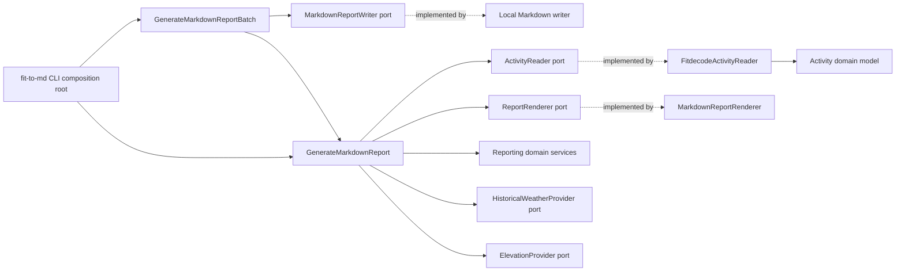
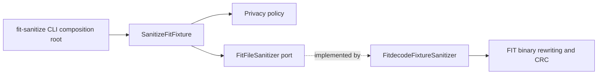

# Architecture

`fitToMd` follows Domain-Driven Design with inward-pointing dependencies. FIT decoding, HTTP providers, Markdown formatting, and CLI concerns are adapters around a decoder-independent domain.

## Bounded Contexts

### Activity

`fit_to_md.domain.activity` contains the normalized activity model:

- `Activity`: session metadata, sport, laps, and records.
- `ActivitySession`: normalized session totals, averages, timestamps, and start coordinates.
- `ActivityLap`: normalized lap measurements.
- `ActivityRecord`: timestamped sensor and route measurements.

The FIT adapter keeps two normalized record views on `Activity`. `records`
retains the existing stream of records with usable measurements for legacy
summary, split, and dynamics behavior. `record_samples` also retains timestamped
records whose measurements are empty. Workout measurement builders consume the
complete sample stream so a missing sample ends the preceding HR or cadence
coverage span; they fall back to `records` for Activities created by other
callers without `record_samples`. A record without a usable timestamp enters
neither stream. Neither view exposes decoder-specific objects.

Workout metadata is defined in `domain/activity/workout.py`: immutable lap roles,
step identities, duration constraints, targets, and typed metadata issues.
`ActivityLap` exposes an optional label and associated step. Unknown, dangling,
or ambiguous references retain lap totals without creating a guessed association.
The FIT adapter resolves explicit step links after collecting all definitions;
native recognized intensity takes precedence over linked-step intensity.

`domain/activity/timeline.py` defines active intervals, normalized timer
transitions, and an evidence-based timeline builder. `Activity.active_timeline`
distinguishes unknown timing (with a reason) from a known empty timeline. It
retains full session boundaries rather than clipping to the first/last record.
Consistent session totals can establish continuous timing when events are absent;
incomplete or inconsistent evidence remains unknown. This contract is intended
for workout measurements; existing record elapsed times and kilometer reporting
retain their previous behavior.

The first metadata implementation supports open, time, and distance durations;
open targets and decoded custom speed/cadence ranges; and open secondary targets.
Unsupported target kinds, unresolved zones, and unverified secondary ranges carry
typed reasons and cannot supply a comparable definition. Labels preserve text
with normalized whitespace; the Markdown adapter escapes table syntax.
Elevation enrichment replaces records while retaining these Activity contracts.

The FIT adapter uses only verified source associations. The installed fitdecode
profile maps `lap.intensity` (field 23) to native role, `lap.wkt_step_index`
(field 71) to the explicit step reference, and `workout_step.message_index`
(field 254) to the definition identity. `lap.message_index` is the lap's own
identity, not a step reference. A recognized lap role wins a conflict with a
linked step. Definition references are validated and resolved after all messages
are read, so source order does not matter. Missing, dangling, invalid, or
ambiguous links never produce inferred labels or comparison groups. FIT
`event`/`event_type`/`timestamp` fields establish timer transitions; generic
workout-step events do not provide a verified decoded step reference.
Duration-distance and duration-time subfields already have decoded meter and
second units; the adapter does not apply FIT scaling again. The
[Phase 0 evidence](workout-aware-report-phase-0.md) records field IDs, enum
mappings, unsupported targets, and installed-profile limitations.

`ActiveTimeline` contains ordered, nonoverlapping half-open active intervals and
an evidence source (`timer_events`, `session_totals`, or `unknown`). An unknown
timeline has a typed issue and no intervals; it is distinct from a known empty
timeline. Timer events must fall within session bounds, and their active durations
must agree with timer totals. Session elapsed time may end with the timer or
include a later idle period before the session is saved; it must be at least the
active duration and no longer than the session's wall-clock bounds. Without events,
matching elapsed and timer totals can establish a continuous interval only when
bounds also agree. A pause with an unknown location cannot be assigned to a lap.
Coverage calculations intersect samples with active intervals, cap each sample
at five wall-clock seconds, deduplicate timestamps, and leave uncovered active
time unknown. A sample exactly at a pause stop can establish an HR endpoint but
adds no duration. Native lap totals survive uncertain timing while unsafe
record-derived calculations remain unavailable.

These entities contain no fitdecode objects, raw FIT dictionaries, or FIT field names. Another decoder can produce the same model without changing reporting rules.

### Reporting

`fit_to_md.domain.reporting` contains:

- immutable report entities (`FitReport`, `SessionSummary`, `Split`, and dynamics samples);
- ports for rendering, elevation, and historical weather;
- immutable provider lookup results that preserve usable enrichment values
  alongside typed operational diagnostics;
- a typed elevation diagnostics contract for progress callbacks and structured
  per-run request statistics;
- domain services that compute summaries, kilometer splits, smoothed elevation, and dynamics from an `Activity`;
- `WorkoutReport` and native-lap rows with typed measurement coverage and reasons;
- `HeartRateZoneBoundaries` and `HeartRateZoneReport`, with five measured zones,
  session and optional per-lap durations, and separate covered/unknown active time;
- `RepetitionAnalysis` for comparable explicitly linked work laps, and
  `RecoveryAnalysis` for signed HR change over the first 60 active seconds.

`NativeLapReportBuilder`, `HeartRateZoneBuilder`, `RepetitionAnalysisBuilder`,
and `RecoveryAnalysisBuilder` are pure domain services. The zone builder assigns
a threshold value to the higher zone and uses covered HR time for zone
percentages. The repetition builder groups only compatible linked step
definitions and uses equal-weight population variation. The recovery builder
requires an explicit work predecessor, usable active timing, and nearby valid
HR observations at both targets. Every unavailable result carries a typed
reason for the Markdown adapter to explain. These new calculations do not alter
the legacy kilometer sections.

Reporting is the only domain context that may depend on Activity. Activity does
not depend on Reporting.

### Privacy

`fit_to_md.domain.privacy` contains the FIT-fixture sanitization policy, the
`FitFileSanitizer` port, and the immutable `SanitizationSummary` returned by that
port. The policy decides which FIT messages and fields are retained; it is
intentionally FIT-specific because its purpose is to produce safe, structurally
valid FIT fixtures rather than a format-neutral activity model.

Privacy is isolated from Activity and Reporting. Binary FIT parsing, timestamp
rewriting, definition rebuilding, CRC generation, and file output belong to the
`FitdecodeFixtureSanitizer` infrastructure adapter.

Sanitization removes private metadata but deliberately retains the complete GPS
track. As the README warns, a route can identify sensitive locations, so a
sanitized fixture must be inspected before publication.

## Current Layers and Flows

The diagrams in this section describe the code as it exists. They are not a
target-state diagram.

### Report generation

The `fit-to-md` CLI is the report composition root: it selects concrete FIT,
Markdown, weather, and elevation adapters and injects them into
`GenerateMarkdownReport`. Typed `ReportGenerationOptions` default to workout
mode `off` and no HR zones. The CLI parses and validates `--workout-report` and
`--hr-zone-boundaries` (including config-file values) before activity reads or
provider calls. Application assembly invokes the workout builders only when
requested; zone configuration is independent of lap mode. The default
composition remains local and does not create weather or elevation providers.

When elevation enrichment is enabled, the composition root also retains the
provider through the narrower `ElevationDiagnostics` contract. The CLI uses
that explicit handle to register progress output and format structured run
statistics. It does not discover diagnostics by inspecting generator or
reader internals, and providers do not return user-facing usage text.

Directory batch policy belongs to `GenerateMarkdownReportBatch`. It plans output
names for all sources, recognizes current and legacy activity-time names, skips
existing reports, rejects collisions before enrichment or rendering, continues
after expected per-file failures, and writes accepted reports incrementally
through `MarkdownReportWriter`. The CLI enumerates sorted direct-child FIT files,
renders typed outcomes for the user, and chooses the final exit status.

`GenerateMarkdownReport.inspect` decodes an activity and returns only the
effective report start time. Batch planning can therefore determine activity-time
destinations without weather, elevation, workout calculations, or rendering Markdown.
Accepted files may be decoded again during generation so the batch does not
retain every decoded activity or rendered report in memory.

The Activity context owns the `ActivityReader` port. `FitdecodeActivityReader`
implements it by translating FIT fields into decoder-independent `Activity`
entities and does not depend on reporting services or external providers.
`GenerateMarkdownReport` orchestrates activity reading, optional DEM and weather
provider calls, report calculation, assembly, and rendering. DEM route sampling,
coverage handling, interpolation, and hybrid replacement rules remain pure
Reporting domain behavior.

`ActivityReader` implementations translate decoder-specific failures into typed
invalid or unsupported activity errors. Weather and elevation providers return
typed lookup results rather than using absence for every failure. The application
collects provider diagnostics while retaining successful or partial values, and
the CLI renders those diagnostics as warnings on stderr. Optional enrichment
failures do not change a successfully generated report's exit status or Markdown
content. Unexpected adapter exceptions are not converted into diagnostics.

### Fixture sanitization

The `fit-sanitize` CLI is a separate composition root. It validates command-line
paths and timestamps, constructs `FitdecodeFixtureSanitizer`, and injects it into
`SanitizeFitFixture`. The use case prevents in-place rewriting, selects the
default privacy policy, and invokes the port. The infrastructure adapter applies
that policy while rebuilding a valid FIT binary.

## Dependency Rules

- Domain modules may depend only on the standard library and other domain modules.
- Application modules depend on domain entities and ports, never concrete infrastructure.
- Infrastructure modules implement ports and translate external formats into domain entities.
- Each CLI is a composition root and owns concrete wiring and configuration.
- Reporting may depend on Activity. Activity may not depend on Reporting.
- Privacy may not depend on, or be depended on by, Activity or Reporting.
- Directory batch planning, output policy, and partial-failure handling belong to the application layer; the CLI owns source discovery and presentation.
- External HTTP behavior must be covered with fakes; tests must not require live network access.

`tests/unit/domain/test_architecture.py` resolves both absolute and relative
imports to enforce these layer rules. It rejects external dependencies and
outward-facing project imports from the domain, concrete adapter imports from
the application, and unsupported dependencies between bounded contexts.
Reporting may consume Activity; Activity cannot depend on Reporting, and Privacy
remains isolated from both contexts.

The former `infrastructure.fitdecode.builders` and `infrastructure.fitdecode.models` modules are compatibility-only re-exports. New code must import reporting services and activity entities from the domain packages directly.

## Extending the Project

- Add another activity format by translating it to `Activity`, `ActivityLap`, and `ActivityRecord`.
- Implement `ActivityReader` for another source format and inject it into the report use case.
- Add a report calculation in the reporting domain services and cover happy and failure paths with domain unit tests.
- Add a new output block through a `ReportSectionRenderer` implementation.
- Add an external provider by implementing the relevant port and injecting it from the CLI composition root.
